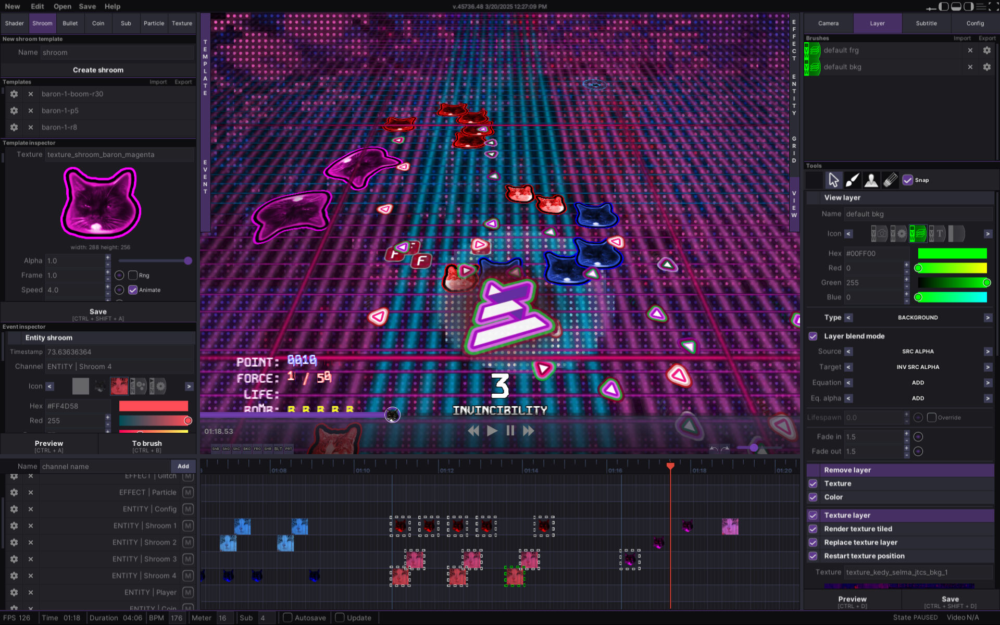

### Play visu at [itch.io](https://alkapivo.itch.io/visu-project) or watch gameplay on [YouTube](https://www.youtube.com/Alkapivo)


> "Touhou + cats + LSD = visu-project"

Visu is an experimental **bullet hell game** that combines classic mechanics inspired by Touhou with mind-blowing visual effects. It’s an intense fusion of rhythm, chaos, and visual effects.

Each level is a single track—music drives the action, while the visuals pulse and shift in sync. The game space transforms dynamically, pulling players into an audiovisual experience.

Visu features a **built-in level editor** that allows you to create your own compositions. The system is based on a timeline and inspectors, giving you precise control over game assets, from bullet patterns to special effects.

The current version includes six levels, but **Visu is still a work in progress**. This is not a finished game, but rather a **playable demo** showcasing the core mechanics and visual style. The project is actively evolving, with more content and features planned for the future.

For the full experience, the **Windows version is recommended**, as it includes all features and the most stable performance. However, I’ve also provided an **experimental browser build**, allowing you to try Visu directly in your browser. Keep in mind that this version may have limitations or reduced performance.

**Ready to dive into a glitched-out reality? 🚀**

---

### Building
Before running a project, whether in the GameMaker IDE or using the CLI, some additional data must be downloaded separately.  
With the [gm-cli](https://github.com/Alkapivo/gm-cli) tool, this can be done automatically:  
```bash
gm-cli install 
gm-cli run setup
```  
This operation must be performed **after every update** to make sure new tracks were loaded successfuly. Then, the project can be built and launched with the command:  
```bash
gm-cli make -r YYP -l
```  
Please remember that for `gm-cli make` to work, some environment variables must be set up. They can be added manually or by creating a `gm-cli.env` file in this repository. Example:  
```bash
GMS_IGOR_PATH="{PATH_TO_IGOR_EXE}"
GMS_PROJECT_NAME="visu-project"
GMS_PROJECT_PATH="{PATH_TO_VISU_PROJECT_REPOSITORY}/yyp"
GMS_USER_PATH="{PATH_TO_ROAMING_GAMEMAKERSTUDIO2_USER_FOLDER}"
GMS_RUNTIME_PATH="{PATH_TO_RUNTIME_2024.6.1.208}"
GMS_RUNTIME="VM"
GMS_TARGET="windows"
```
---

This repository only contains the GameMaker YYP project. The actual development and code are kept in [visu-gml](https://github.com/Barons-Keep/visu-gml) and [visu-track](https://github.com/Barons-Keep/visu-track) and are synced with this repository using [gm-cli](https://github.com/Alkapivo/gm-cli).  

As a result, I don't have to use the GameMaker IDE or GMEdit—I can just use Visual Studio Code. 😎  

